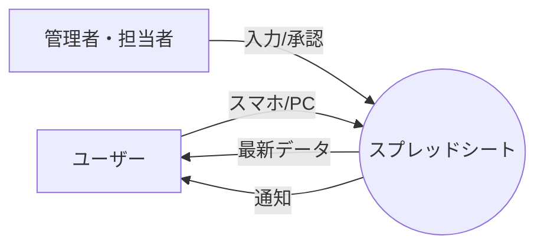
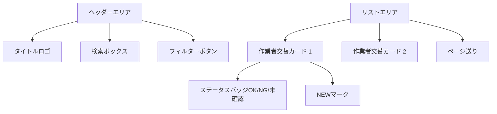

# OSG (Operator Shift Guard) 使用マニュアル

**Operator Shift Guard (OSG)** は、工場内の作業者交替情報をリアルタイムで共有・管理するためのWebアプリケーションです。

---

## 目次

1. [アプリの概要](#1-アプリの概要)
2. [利用開始まで（導入手順）](#2-利用開始まで導入手順)
3. [画面の見方](#3-画面の見方)
4. [基本的な使い方](#4-基本的な使い方)
5. [トラブルシューティング](#5-トラブルシューティング)

---

## 1. アプリの概要

このアプリは「誰が、いつ、どのラインで交替したか」をスマホやPCから簡単に確認・記録できます。

### ✨ 主な機能
*   **リアルタイム通知**: 新しい交替情報が入ると、画面通知でお知らせします。
*   **既読管理**: 一度確認した情報は「NEW」マークが消えるため、未確認情報が一目でわかります。
*   **オフライン対応**: 電波の悪い場所でも、一度読み込んだデータは閲覧可能です。

---

## 2. 利用開始まで（導入手順）

### ステップ 1：ログイン

1. 管理者から配布された **URL** にアクセスします。
2. ログイン画面が表示されます。
3. **ユーザーID（メールアドレス）** と **パスワード** を入力し、「ログイン」ボタンを押します。

> [!NOTE]
> 初回ログイン時のパスワードは管理者にお問い合わせください。ログイン後、右上メニューから変更可能です。

### ステップ 2：アプリのインストール（推奨）

このアプリは **PWA（プログレッシブ・ウェブ・アプリ）** 対応です。スマホのホーム画面に追加することで、通常のアプリと同じように使えます。

#### iPhone (Safari) の場合
1. 画面下部の **共有ボタン** <i class="fa-solid fa-arrow-up-from-bracket"></i> をタップ
2. メニューをスクロールして **「ホーム画面に追加」** <i class="fa-regular fa-square-plus"></i> を選択
3. 右上の「追加」をタップ

#### Android (Chrome) の場合
1. 画面右上の **メニューボタン** <i class="fa-solid fa-ellipsis-vertical"></i> をタップ
2. **「アプリをインストール」** または **「ホーム画面に追加」** を選択
3. 確認画面で「インストール」をタップ

---

## 3. 画面の見方

### メイン画面（リスト表示）

画面は大きく分けて「ヘッダー（上部）」と「リスト（メイン）」に分かれています。

*   **NEWマーク**: あなたがまだ確認していない新しい情報に表示されます。
*   **ステータスバッジ**:
    *   ■ **完了**: すべての確認が完了
    *   ■ **製造未確認**: 製造課の承認待ち
    *   ■ **品管未確認**: 品質管理課の確認待ち
    *   ■ **NG**: いずれかの項目でNGが発生

---

## 4. 基本的な使い方

### 🔍 情報を探す（検索・フィルター）

ヘッダーにある機能を使って、必要な情報を素早く見つけられます。

*   **キーワード検索**: 「プレス」「田中」「L-123」など、自由な言葉で検索できます。
*   **フィルター機能**:
    *   **処理状況**: 「未確認」のものだけを表示、「NG」だけを表示など
    *   **日付**: 「本日」「昨日」のデータに絞り込み
    *   **職場別**: 「プレス」「部品組立」「キャブ組立」で絞り込み
    *   **完成工程**: 工程記号 ◎ の有無で絞り込み

### 📝 詳細を確認・編集する

リストのカード（白い枠）をタップすると、详细情報が展開されます。

1. **カードをタップ**: 詳細エリア（製造課欄・品管課欄）が開きます。
    *   *この時点で「NEW」マークは消え、既読になります。*
2. **編集ボタン**: 編集権限がある場合、各セクションの右上に「鉛筆マーク <i class="fa-solid fa-pen-to-square"></i>」が表示されます。
3. **入力・保存**:
    *   必要な項目を入力・選択します。
    *   「保存」ボタンを押すと、クラウド上のデータが更新され、他の全員にも即座に反映されます。

### 🔄 データの更新

このアプリは定期的に自動更新されますが、手動で最新にすることもできます。

*   **自動更新**: 設定した時間（デフォルト5分）ごとに自動でデータをチェックします。新しい情報があれば通知が出ます。
*   **手動更新**: 右上の「更新ボタン <i class="fa-solid fa-arrows-rotate"></i>」を押すと、その場で最新データを取得します。

### ⚙️ 各種設定

右上の「ユーザー設定ボタン <i class="fa-solid fa-user-gear"></i>」から以下の操作が可能です。

*   **自動更新間隔の変更**: 1分〜9分の間で設定できます。
*   **パスワード変更**: セキュリティのため、定期的な変更をお勧めします。
*   **全て既読にする**: 溜まった「NEW」マークを一括で消去します。

---

## 5. トラブルシューティング

| 困ったときは... | 対処法 |
| :--- | :--- |
| **画面が真っ白になる** | ブラウザの「再読み込み」を行ってください。それでも直らない場合はキャッシュの削除を試してください。 |
| **「更新に失敗しました」** | インターネット接続を確認してください。機内モードになっていないか確認しましょう。 |
| **通知が来ない** | 端末の通知設定で、ブラウザ（Safari/Chrome）からの通知が許可されているか確認してください。 |
| **ログインできない** | ID（メールアドレス）のスペルミスがないか確認してください。パスワードを忘れた場合は管理者へ連絡してください。 |

---
**Operator Shift Guard System**
Developed for Factory Manufacturing Dept.
