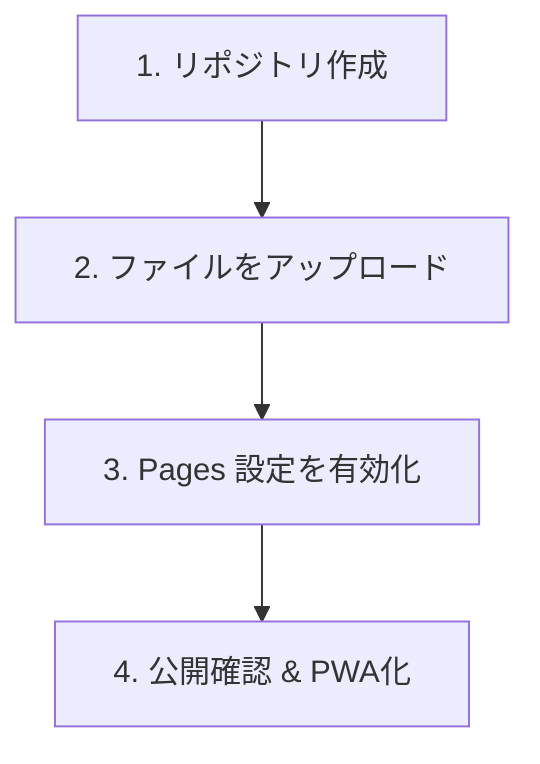

# GitHub Pages デプロイ手順書（図解版）

GitHubでのデプロイが初めての方向けに、ブラウザ操作のみで完結する簡単な手順をまとめました。

---

## 全体の流れ

---

## 手順 1：リポジトリ（保管場所）の作成

1. [GitHub](https://github.com/)にログインし、右上の **「+」** ボタンから **「New repository」** を選択します。
2. 設定項目を以下のように入力します：
   - **Repository name**: `ht-osg-system` など（他人に見つかりにくい名前にしましょう）
   - **Public**: チェックを入れる（無料版で公開するには必須です）
   - **Initialize this repository...**: 何もチェックせずそのままでOK
3. 一番下の **「Create repository」** ボタンを押します。

---

## 手順 2：ファイルをアップロードする

1. リポジトリ作成後の画面にある、 **「uploading an existing file」** という青いリンクをクリックします。
2. パソコン上のプロジェクトフォルダ（`OSG-app` フォルダの中身すべて）を選択し、GitHubの画面へドラッグ＆ドロップします。

> [!IMPORTANT]
> **重要！フォルダ構造に注意してください**
> `index.html` がリポジトリの直下（一番上の階層）にあることを確認してください。
> `html/`, `js/`, `css/` などのフォルダもそのままの構造でアップロードします。

3. アップロードが終わったら、画面下の **「Commit changes」** ボタンを押して確定させます。

---

## 手順 3：GitHub Pages を有効にする（公開設定）

1. リポジトリの画面上部にある **「Settings」**（歯車アイコン）をクリックします。
2. 左側のメニューにある **「Pages」** をクリックします。
3. **Build and deployment** セクションの各項目を確認します：
   - **Source**: `Deploy from a branch`
   - **Branch**: `main` (または `master`) と `/ (root)` を選択
4. **「Save」** ボタンを押します。

---

## 手順 4：公開の確認

1. **Pages** の画面の一番上に、 **「Your site is live at...」** というメッセージが表示されるまで数分待ちます。
2. 表示されたURLをクリックして、ログイン画面が表示されたら成功です！

---

## おまけ：スマホでのPWA（アプリ化）方法

GitHub PagesのURL（`https://...github.io/...`）をスマホで開きます。

### iPhone (Safari) の場合
1. 下部の **共有ボタン**（四角から矢印が出ているアイコン）を押す
2. **「ホーム画面に追加」** を選択

### Android (Chrome) の場合
1. 右上の **設定ボタン**（三点リーダー）を押す
- **「アプリをインストール」** または **「ホーム画面に追加」** 
を選択

> [!TIP]
> ホーム画面にOSGのロゴアイコンが表示され、次からは普通のアプリのようにワンタップで起動できるようになります！
